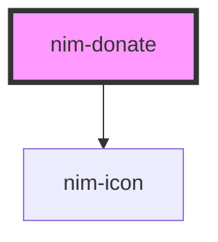

# nim-donate

<!-- Auto Generated Below -->

## Properties

| Property    | Attribute   | Description                                                                                                     | Type                                                                            | Default        |
| ----------- | ----------- | --------------------------------------------------------------------------------------------------------------- | ------------------------------------------------------------------------------- | -------------- |
| `fee`       | `fee`       | Transaction fee in luna. Default: 0                                                                             | `number`                                                                        | `undefined`    |
| `logoUrl`   | `logo-url`  | An image URL. Must be on the same origin as the request is sent from. Should be square and at least 146x146 px. | `string`                                                                        | `undefined`    |
| `network`   | `network`   | The network you want to use. Can be 'main' or 'test'.                                                           | `"main" \| "test"`                                                              | `'main'`       |
| `recipient` | `recipient` | The human-readable address of the recipient (your shop/app).                                                    | `string`                                                                        | `undefined`    |
| `text`      | `text`      | The text to display on the button. Default: "Donate NIM"                                                        | `string`                                                                        | `'Donate NIM'` |
| `theme`     | `theme`     | The theme of the button. Use light when using against dark background.                                          | `"blue" \| "gold" \| "green" \| "light-blue" \| "neutral" \| "orange" \| "red"` | `'neutral'`    |

## Dependencies

### Depends on

- [nim-icon](../icon)

### Graph

----------------------------------------------

*Built with [StencilJS](https://stenciljs.com/)*
